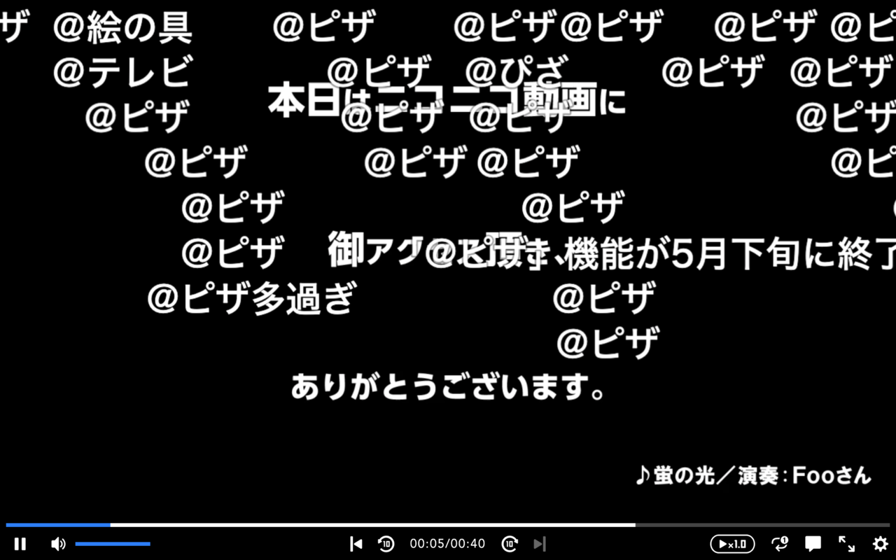

# at-pizza-nico

ニコニコ動画の「＠ピザ」コマンドをオマージュした拡張機能

## Installation

## How to use

## Link

- [予告：5/28 ピザを注文するための「@ピザ機能」提供終了のお知らせ【PC版ニコニコ動画】](https://blog.nicovideo.jp/niconews/221123.html)

- [@ピザ](https://qa.nicovideo.jp/faq/show/7386?site_domain=default#g)

## License

This project is licensed under the MIT License - see the [LICENSE](LICENSE) file for details.
